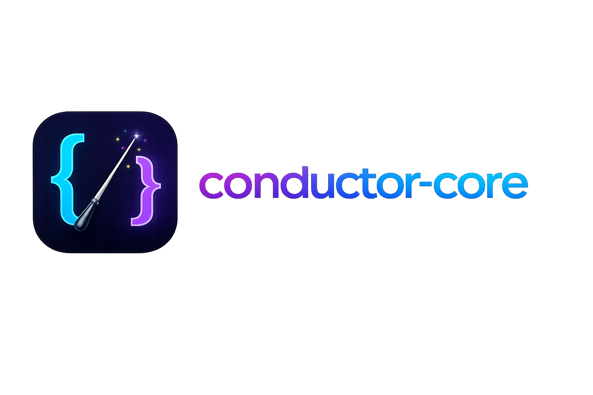

<div align="center">
  
</div>

# Conductor Core

`conductor-core` is the reusable prompt-to-MIDI engine behind the Conductor
applications. It gives CLIs, notebooks, backend services, test harnesses, and
user interfaces one provider-independent generation API without pulling UI or
evaluation dependencies into the process.

Core provides:

- routing and response parsing for OpenAI, Anthropic, Google, and Ollama;
- validated four-bar music models and prompt assembly;
- model capability metadata;
- loop-to-MIDI and MIDI-to-loop conversion;
- generation history and artifact storage;
- optional MIDI-to-audio rendering; and
- structured results, errors, logging, and progress events.

Core is currently pre-release. Its API is typed and tested, but consumers
should pin a release tag and review the [changelog](CHANGELOG.md) when upgrading.

## Install

Choose only the optional features your application needs. Use `providers` for
all hosted and local model providers, a provider name such as `google` for one
provider, and `playback` for audio helpers.

```powershell
uv add "conductor-core[providers] @ git+https://github.com/laceyp99/conductor-core.git@v0.5.1"
```

## Generate a loop

```python
from conductor_core import EngineConfig, GenerationRequest, LoopGenerationEngine

engine = LoopGenerationEngine(EngineConfig.from_defaults())
result = engine.generate(
    GenerationRequest(
        key="C",
        scale="Major",
        description="warm neo-soul electric piano chords",
        model="gemini-3.1-flash-lite",
        temperature=0.3,
    )
)

print(result.midi_path)
```

`generate()` synchronously calls the selected provider, validates its loop,
converts the loop to MIDI, and persists the result. Provider credentials can be
injected through `EngineConfig` or supplied through the supported environment
variables.

## Documentation

- [Getting started](docs/getting-started.md): installation, credentials, and a
  complete first generation.
- [Generation guide](docs/generation.md): request options, model capabilities,
  prompts, progress, errors, and logging.
- [Artifacts and audio](docs/artifacts-and-audio.md): storage, retention, MIDI
  utilities, and optional MP3 previews.
- [Development](docs/development.md): environment setup, validation, and
  documentation commands.
- [Changelog](CHANGELOG.md): release history and migration notes.

The documentation is also configured for local browsing with MkDocs.

## License

Conductor Core is available under the [MIT License](LICENSE).
