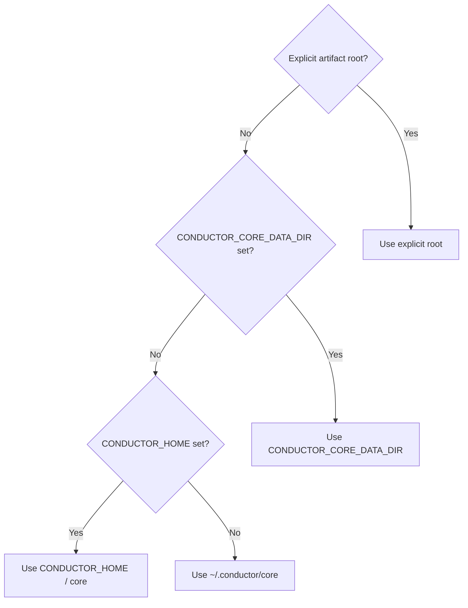

# Artifacts and audio

## Data directory

Core stores durable history under one predictable Conductor suite root:

```text
~/.conductor/
  core/
    generations/
      gen_<id>/
        loop.mid
        loop.mp3          # only when audio rendering succeeds
        messages.json     # when provider messages are available
        metadata.json
```

On Windows, the default is `%USERPROFILE%\.conductor\core`. Selection follows
this precedence:

1. `CONDUCTOR_CORE_DATA_DIR` selects Core's complete project data directory.
2. `CONDUCTOR_HOME` selects the shared suite root; Core appends `core`.
3. Core uses `Path.home() / ".conductor" / "core"`.

Both environment variables support `~` expansion.



```powershell
$env:CONDUCTOR_HOME = "D:\ConductorData"
$env:CONDUCTOR_CORE_DATA_DIR = "D:\ConductorData\custom-core"
```

An explicit `EngineConfig.artifact_root` or `FilesystemArtifactStore` root
overrides the default. Resolving or importing paths does not create directories;
Core creates the history directory only when writing a generation workspace.
Packaged prompts, metadata, and the bundled SoundFont remain read-only package
resources.

## Retention

Core retains the newest 20 generations by default. MIDI, JSON, and especially
MP3 files can still consume substantial space. Configure retention on the
engine or store; use `None` only when the calling application owns disk policy.

```python
from conductor_core import EngineConfig
from conductor_core.storage import FilesystemArtifactStore

config = EngineConfig.from_defaults(max_generations=100)
unlimited_store = FilesystemArtifactStore("my-output", max_generations=None)
```

## Generation results

| Attribute | Contents |
| --- | --- |
| `generation_id` | Unique filesystem generation identifier. |
| `loop` | Validated provider-independent loop object. |
| `midi_path` | Persisted MIDI path. |
| `audio_path` | Persisted MP3 path when rendering succeeds. |
| `messages` | Provider conversation or response messages. |
| `cost` | Provider-reported estimated cost when available. |
| `metadata` | Persisted generation metadata. |
| `warnings` | Non-fatal issues such as skipped audio. |

Use `FilesystemArtifactStore` for custom roots, loading or deleting saved
generations, and updating saved audio metadata.

## Audio previews

Set `render_audio=True` to render an MP3 after MIDI generation. Install the
`playback` extra and place FluidSynth and FFmpeg on `PATH`. With no
`soundfont_path`, Core uses its packaged SoundFont; set the request path or
`EngineConfig.default_soundfont_path` to choose another.

Audio failure does not discard successful MIDI generation. Core returns a
warning and `audio_path=None`. Lower-level discovery and rendering helpers live
in `conductor_core.playback`.

## Direct MIDI utilities

Consumers can convert existing MIDI to Core's four-bar loop model and write it
back without calling a provider. See
[`scripts/midi_loop_roundtrip.py`](https://github.com/laceyp99/conductor-core/blob/main/scripts/midi_loop_roundtrip.py)
for an
offline example that normalizes note starts and durations to sixteenth-note
integer positions.

Related modules include:

- `conductor_core.models` for loop, bar, note, and timing models;
- `conductor_core.music` for model metadata, prompts, scales, and durations;
- `conductor_core.routing` for lower-level routing;
- `conductor_core.storage` for artifacts and history; and
- `conductor_core.playback` for optional audio operations.

Prefer `LoopGenerationEngine` for complete generation workflows so persistence,
cleanup, prompt handling, and provider behavior remain consistent.
