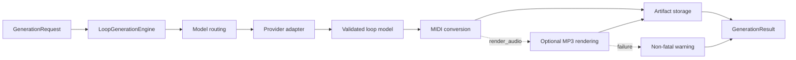

# Generation guide

## Generation flow

Provider-specific behavior stays at the routing and adapter boundary. The rest
of Core works with shared music models and result contracts.



## Request options

| Field | Purpose |
| --- | --- |
| `key` | Supported note name used as the loop's root key, including accepted enharmonic spellings such as `C#` or `Eb`. | 
| `scale` | Supported scale name, matched case-insensitively against `Major` and `minor` scales. |
| `description`	| Nonblank natural-language description of the requested loop. |
| `model` | Nonblank model name used for provider routing and response handling. |
| `temperature` | Finite integer or float from `0.0` through `2.0`; booleans are rejected. |
| `use_thinking` | Strict boolean reasoning control; `False` selects the model's lowest supported setting. |
| `effort` | Reasoning effort string or `None`, passed through when `use_thinking=True`. |
| `prompt_override` | Nonblank prompt for this request, or `None`. |
| `render_audio` | Strict boolean requesting an MP3 preview after MIDI generation. |
| `soundfont_path` | SoundFont name or path, or `None`. |

### Input Validation
`GenerationRequest` validates provider-independent structure when constructed.
Wrong Python types raise `TypeError`; accepted types with invalid values raise
`ValueError`. Integrations receiving strings from forms, command lines, or
environment variables must parse booleans and numbers first.

Model registration, model-specific effort choices, and SoundFont filesystem
checks happen later during routing and audio processing. Inspect capabilities
with `conductor_core.music.get_model_info()` or
[`scripts/inspect_models.py`](https://github.com/laceyp99/conductor-core/blob/main/scripts/inspect_models.py)
rather than assuming
all models accept temperature or the same reasoning settings.

## Reasoning settings

For models with discrete `effort_options`, options are ordered from lowest to
highest. 

With `use_thinking=False`, Core sends the first supported option even
if the request contains a higher valid `effort`. The lowest option may be
`none`, `minimal`, or `low`; `False` therefore means the lowest available
setting, not necessarily no provider reasoning.

With `use_thinking=True`, Core validates and sends the requested effort. Models
using thinking budgets retain their provider-specific limits. Because `effort`
defaults to `None`, callers enabling thinking for a model with discrete options
must select a supported value.

## Rate-limit metadata

Packaged cloud models expose `RPM`, `TPM`, and `RPD`. `RPM` is a conservative
positive-integer baseline for the lowest generally supported account tier.
`TPM` and `RPD` are positive integers when a comparable baseline is recorded
and `null` when it is unknown or cannot be represented consistently. Core
exposes this metadata but does not schedule or retry requests from it.

## Prompt customization

Set `prompt_override` on `EngineConfig` for every request made by an engine or
on `GenerationRequest` for one request. Request override takes precedence over
engine override, which takes precedence over the packaged prompt.

## Progress reporting

Pass a callback to `generate(..., progress_callback=...)` to adapt synchronous
work to logs, progress bars, queues, or asynchronous UI wrappers. Current stages
cover provider generation, MIDI processing, and audio rendering. Reporting does
not cancel an in-flight provider request.

## Errors

Hosted providers fail before constructing an SDK client when their required API
key is missing or blank. Authentication failures raise
`ProviderAuthenticationError`; other SDK failures use the public
`ProviderError` hierarchy and identify the provider and operation.

Provider, parsing, and MIDI conversion errors are raised to the caller. Core
removes an unfinished generation workspace when an error occurs after allocation.
Callers should catch exceptions at their application boundary and decide how to
display, retry, or log them.

Lower-level audio failures raise `AudioRenderingError`. The generation engine
treats optional audio failure as non-fatal and returns the MIDI with a warning
and `audio_path=None`.

## Variation contracts (preparation for batch generation)

Core now exposes variation data contracts and a canonical initial prompt.
The `generate_variations(request, count=4)` engine operation, provider array
handling, and batch persistence are follow-up work; they are not available yet.
The planned operation reuses `GenerationRequest` for one shared musical brief.
`validate_variation_count()` defaults to 4 and accepts only integers from 1 to 8;
booleans, floats, and strings are rejected without coercion.

`VariationResult` contains a zero-based `index`, derived `status` (`valid` or
`invalid`), `loop`, optional `generation` (`GenerationMetadata` with artifact
information), and optional `diagnostic`. Invalid items require `loop=None`, a
diagnostic, and no generation information. Valid items can exist before artifacts
are persisted and must not carry a validation diagnostic. Optional audio failure
does not make a valid MIDI loop invalid.

`VariationDiagnostic` uses a nonblank `code` and `message`, plus a nullable
`location` sequence of JSON field names and array indexes. Initial producers
should use `invalid_loop`, `invalid_response`, and `wrong_count` for those three
failure cases. Codes are extensible strings; consumers should tolerate unknown
codes. A location such as `["Bar_1", "notes", 0, "pitch"]` is relative to the item.

`VariationBatchResult` contains ordered `items`, `metadata`, derived `status`,
and a nullable batch-level `diagnostic`. It derives `complete` when all items
are valid, `partial` when some are valid, and `failed` when none are valid.
Callers may omit statuses; contradictory explicit statuses are rejected.
Items must retain every original position in contiguous order, including invalid
neighbors. A wrong top-level count requires an empty item sequence and a batch
diagnostic, so it cannot reference generation artifacts. A non-array response
uses `received_count=None`. An all-invalid array retains its indexed diagnostics.
These contracts never create files or substitute musical fallback content.

`VariationBatchMetadata` contains `batch_id`, `model`, `provider`, `prompt_version`,
`requested_count`, `received_count`, ordered JSON `messages`, nullable `usage`,
and nullable `cost`. Usage holds nullable `input_tokens`, `output_tokens`, and
`total_tokens`. Cost and usage describe the one shared request, including failed
results; unavailable values remain `None`, not zero. Do not sum or divide these
values from per-item generation records. The batch exposes read-only
`requested_count` and `received_count` properties forwarding its metadata.

The new Pydantic models reject unknown fields and support `model_dump_json()`
and `model_validate_json()`. JSON has the shape
`{"metadata": {...}, "items": [...], "status": "partial", "diagnostic": null}`;
counts occur only inside `metadata`, locations/items become arrays, and optional
fields remain explicit `null` values by default. Existing `Loop` parsing is unchanged.

`conductor_core.music.get_variation_prompt()` loads the packaged
`variation_gen_v1.txt`; `VARIATION_PROMPT_VERSION` identifies it. The planned
engine operation uses the existing request override, then engine override, then
this packaged default. An override replaces the entire system prompt and should
be recorded with `prompt_version="override"`. The requested count and shared
brief belong in the provider request, not string interpolation of the resource.
Retry prompts are outside this contract.

`ProgressEvent` adds nullable `batch_id`, `variation_index`, and `status` while
preserving the existing three positional fields and extensible `stage` string.
The correlation status vocabulary is `started`, `validating`, `persisting`,
`valid`, `invalid`, `complete`, `partial`, and `failed`. The planned synchronous
event order is: batch `started`; each item in array order emits `validating`,
then either `invalid` or `persisting` followed by `valid`; finally the batch emits
`complete`, `partial`, or `failed`. Batch events have no variation index; item
events share the batch ID and original zero-based index. A top-level response
failure goes directly from `started` to `failed`. Request/setup/transport errors
remain exceptions. Actual emission belongs to the engine follow-up; current
single-generation events retain `None` for all three new fields.

## Logging

Core logs under `conductor_core` and never configures handlers or global logging.
A `NullHandler` prevents warnings for consumers without logging configuration.

```python
import logging

logging.basicConfig(level=logging.INFO)
# Or route only Core records:
logging.getLogger("conductor_core").addHandler(my_handler)
```
