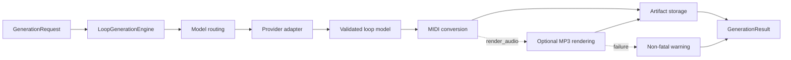

# Generation guide

## Generation flow

Provider-specific behavior stays at the routing and adapter boundary. The rest
of Core works with shared music models and result contracts.



## Request options

| Field | Purpose |
| --- | --- |
| `key` | Supported note name used as the loop's root key, including accepted enharmonic spellings such as `C#` or `Eb`. | 
| `scale` | Supported scale name, matched case-insensitively against `Major` and `minor` scales. |
| `description`	| Nonblank natural-language description of the requested loop. |
| `model` | Nonblank model name used for provider routing and response handling. |
| `temperature` | Finite integer or float from `0.0` through `2.0`; booleans are rejected. |
| `use_thinking` | Strict boolean reasoning control; `False` selects the model's lowest supported setting. |
| `effort` | Reasoning effort string or `None`, passed through when `use_thinking=True`. |
| `prompt_override` | Nonblank prompt for this request, or `None`. |
| `render_audio` | Strict boolean requesting an MP3 preview after MIDI generation. |
| `soundfont_path` | SoundFont name or path, or `None`. |
| `ollama_num_ctx` | Positive integer context window size sent to Ollama as `num_ctx`, or `None` to keep Ollama's server or model default. Ignored, with a warning, for cloud models. Also available on `VariationGenerationRequest`. |

### Input Validation
`GenerationRequest` validates provider-independent structure when constructed.
Wrong Python types raise `TypeError`; accepted types with invalid values raise
`ValueError`. Integrations receiving strings from forms, command lines, or
environment variables must parse booleans and numbers first.

Model registration, model-specific effort choices, and SoundFont filesystem
checks happen later during routing and audio processing. Inspect capabilities
with `conductor_core.music.get_model_info()` or
[`scripts/inspect_models.py`](https://github.com/laceyp99/conductor-core/blob/main/scripts/inspect_models.py)
rather than assuming
all models accept temperature or the same reasoning settings.

## Reasoning settings

For models with discrete `effort_options`, options are ordered from lowest to
highest. 

With `use_thinking=False`, Core sends the first supported option even
if the request contains a higher valid `effort`. The lowest option may be
`none`, `minimal`, or `low`; `False` therefore means the lowest available
setting, not necessarily no provider reasoning.

Anthropic models that support adaptive thinking are the exception: with
`use_thinking=False`, Core sends `thinking: {"type": "disabled"}` and no effort,
so the model does not think and uses a caller-selected temperature where the
model accepts one. Claude Opus 5.5 and Fable models always think; for them,
`False` sends the lowest effort.

With `use_thinking=True`, Core validates and sends the requested effort. Models
using thinking budgets retain their provider-specific limits. Because `effort`
defaults to `None`, callers enabling thinking for a model with discrete options
must select a supported value.

Models with `temperature_supported: false` reject a caller-selected
temperature, so Core never sends one to them; the requested `temperature` is
ignored. This covers OpenAI reasoning models, Gemini 3.7 and 3.8 Flash, and
Claude Opus 4.7 and later, Sonnet 5, and Fable models.

Some models require a specific temperature while thinking is enabled. A model's
`thinking_fixed_temperature` reports the temperature Core sends in that case,
regardless of the requested one. It is `1.0` for Claude Opus 4.6, Sonnet 4.6,
and the Claude 4.5 models. When the field is absent or `null` and the model
supports temperature, Core sends the requested value. Ollama's
`model_capabilities` entries always include the field as `null`.

## Rate-limit metadata

Packaged cloud models expose `RPM`, `TPM`, and `RPD`. `RPM` is a conservative
positive-integer baseline for the lowest generally supported account tier.
`TPM` and `RPD` are positive integers when a comparable baseline is recorded
and `null` when it is unknown or cannot be represented consistently. Core
exposes this metadata but does not schedule or retry requests from it.

## Prompt customization

Set `prompt_override` on `EngineConfig` for every request made by an engine or
on `GenerationRequest` for one request. Request override takes precedence over
engine override, which takes precedence over the packaged prompt.

## Progress reporting

Pass a callback to `generate(..., progress_callback=...)` to adapt synchronous
work to logs, progress bars, queues, or asynchronous UI wrappers. Current stages
cover provider generation, MIDI processing, and audio rendering. Reporting does
not cancel an in-flight provider request.

## Errors

Hosted providers fail before constructing an SDK client when their required API
key is missing or blank. Authentication failures raise
`ProviderAuthenticationError`; other SDK failures use the public
`ProviderError` hierarchy and identify the provider and operation.

When an Ollama response stops because the prompt and response filled the
model's context window, Core raises `ProviderContextLengthError`, a
`ProviderRequestError` subclass, instead of a parsing error. Its `model`,
`prompt_tokens`, `output_tokens`, and `context_length` attributes are set when
known; the message never includes partial output or thinking text. Core does
not retry. Disable thinking, choose a model or server with a larger context, or
set `ollama_num_ctx` on the request. Core never chooses a context size itself:
larger windows use more memory and can prevent a model from loading.

Provider, parsing, and MIDI conversion errors are raised to the caller. Core
removes an unfinished generation workspace when an error occurs after allocation.
Callers should catch exceptions at their application boundary and decide how to
display, retry, or log them.

Lower-level audio failures raise `AudioRenderingError`. The generation engine
treats optional audio failure as non-fatal and returns the MIDI with a warning
and `audio_path=None`.

For single-request ordered alternatives, see
[Generate loop variations](variations.md).

## Logging

Core logs under `conductor_core` and never configures handlers or global logging.
A `NullHandler` prevents warnings for consumers without logging configuration.

```python
import logging

logging.basicConfig(level=logging.INFO)
# Or route only Core records:
logging.getLogger("conductor_core").addHandler(my_handler)
```
